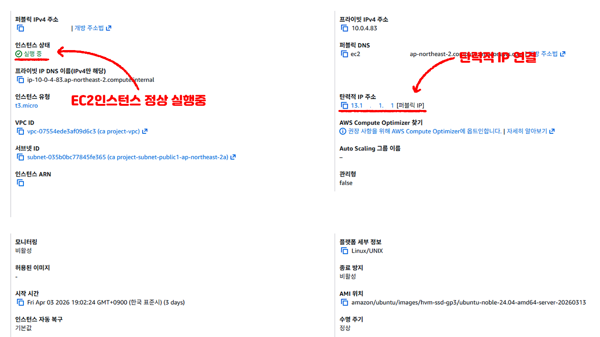
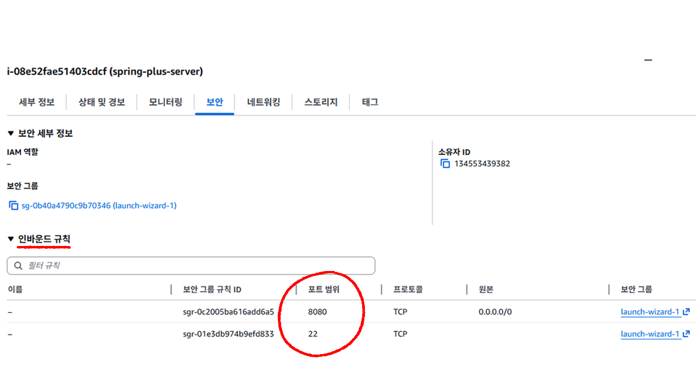
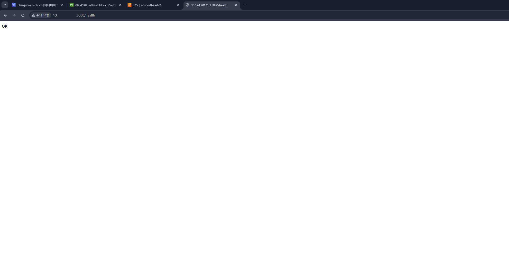
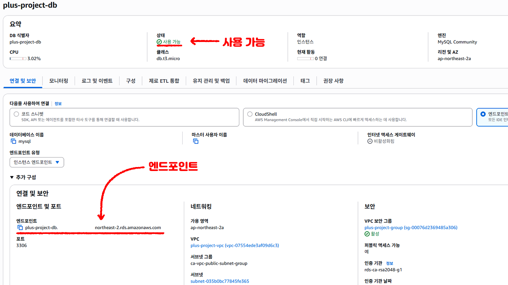
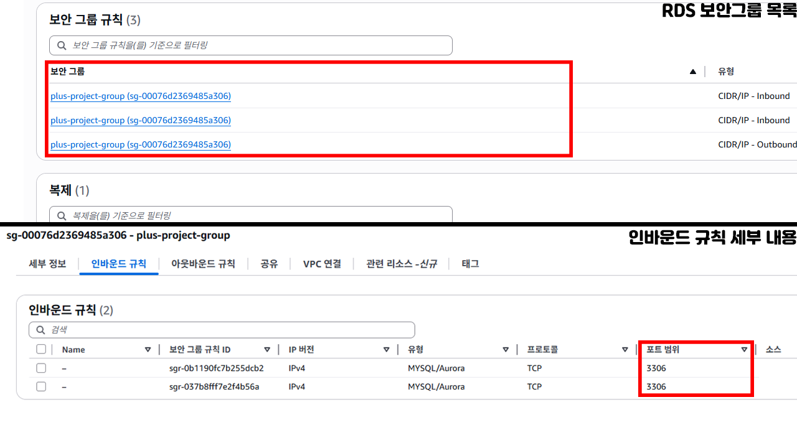
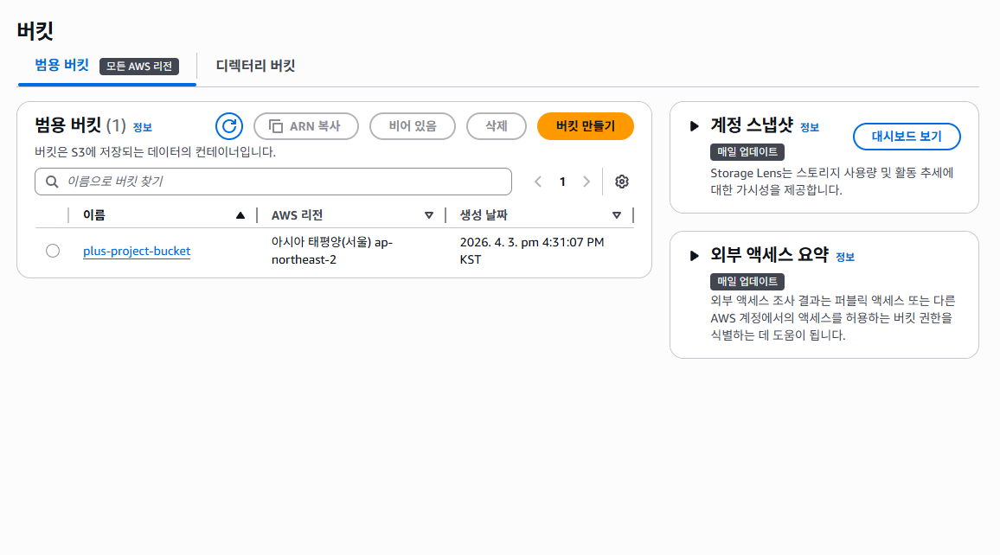
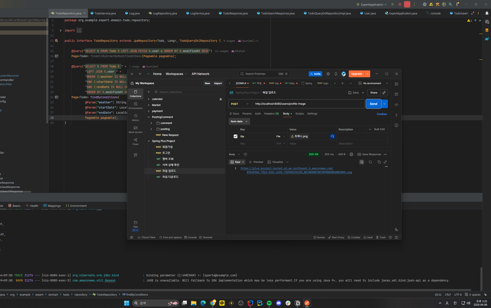
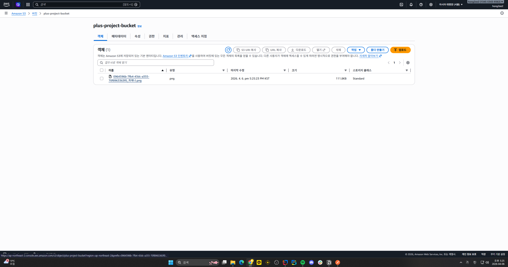
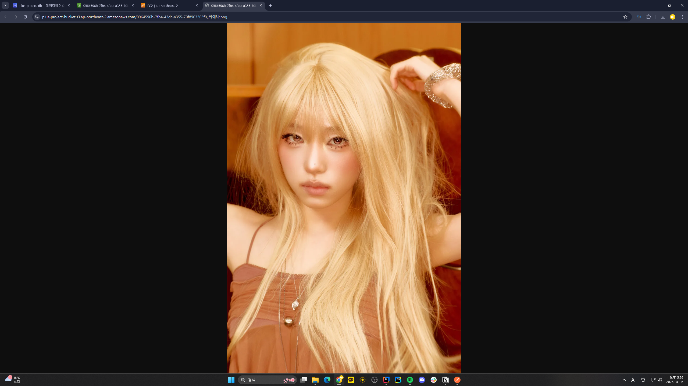

# SPRING PLUS PROJECT

---

## EC2

### EC2 인스턴스 목록

### EC2 인스턴스를 봤을 때 정상 실행 중이라고 뜨며 탄력적 IP 13.1XX.XX1.XX1이 연결된 상태인것이 잘 나오고있습니다.

---

### 보안그룹 인바운드 규칙

### 8080 포트는 모든 IP에서 접근 가능하도록 설정하고, SSH(22번 포트)는 내 IP에서만 접근 가능하도록 설정하였습니다.

---

### Health Check API 응답

### 이후 http://13.XX4.XXX.XX1:8080/health 로 접속했을 때 OK 응답이 잘 나오는것을 확인할 수 있으며, 서버가 정상 동작 중임을 확인할 수 있었습니다.

---

## RDS

### RDS 엔드포인트

### RDS 인스턴스 plus-project-db가 사용 가능 상태이며, 엔드포인트 plus-project-db.XXXXXXXXXXXX.ap-northeast-2.rds.amazonaws.com으로 EC2 애플리케이션과 연결하였습니다.

---

### RDS 보안그룹 인바운드 규칙

### 3306 포트에 대해 내 IP와 EC2 프라이빗 IP(10.0.4.83)에서만 접근 가능하도록 인바운드 규칙을 설정한것을 확인할 수 있습니다.

---

## S3

### S3버킷 목록

### S3 버킷 목록입니다. AWS 리전은 정상적으로 "아시아 태평양(서울) ap-northeast-2"로 잡혀있습니다.

---

### 이미지 업로드

### 생성한 버킷에 유저가 사진을 업로드 하였을 때 정상적으로 동작하는지 테스트를 해보았습니다.
### Postman으로 제가 좋아하는 아이돌인 최예나씨의 사진을 http://localhost:8080/users/profile-image API에 POST하여 업로드해보았습니다.

---

### 이미지 업로드 확인

### S3버킷을 확인해본 결과 정상적으로 이미지가 잘 업로드된것을 확인할 수 있었고, 웹에 링크로 이미지를 열었을 때 정상적으로 잘 나오는것을 확인할 수 있었습니다.

---

